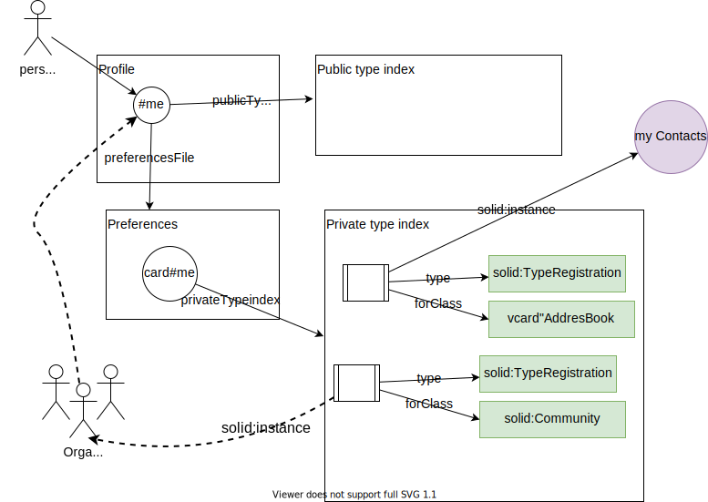

# Solid Application Data Discovery (draft)

Next, the information that an application can use to learn how to interact with the data associated with the Social Agent's WebID will be presented. To interact with data, the app needs to know what type of data the Social Agent has and where to find it. For this purpose, the Type Registry Index SHOULD exit.

The Type Registry Index MAY consists of two separate registry index resources: one public (readable by default) called `publicTypeIndex.ttl` and one private (readable by the owner only, by default) called `privateTypeIndex.ttl`. They are linked from the Profile Document (WebID document, Extended profile document) or the Preference File through the following predicates: for the Public Type Index Resource with the `solid:publicTypeIndex` predicate and for the Private Type Index Resource with the `solid:privateTypeIndex` predicate.

### Type Index Resource links example:

An example for a Public Type Index Resource linked from the profile is:
```
   <#WebID> <http://www.w3.org/ns/solid/terms#publicTypeIndex> </settings/publicTypeIndex> .
```
An example for a Private Type Index Resource linked from the profile is:
```
   <#WebID> <http://www.w3.org/ns/solid/terms#privateTypeIndex> </settings/privateTypeIndex> .
```

A diagram about the Type Registry Index is presented next:


### Public Type Index (publicTypeIndex.ttl)

The Public Type Index Resource contains registration entries that are *discoverable by
outside users and applications*. For example, think of a registration like a phone number in
a public phonebook, which contains publicly-discoverable mappings of people's
names to phone numbers and addresses.

The Public Type Index MUST have the following properties:

* Is linked to from the WebID Profile using the `solid:publicTypeIndex` predicate
* Is created in `/settings/publicTypeIndex.ttl` by default
* Has a public-readable ACL by default
* Is of type `solid:ListedDocument` and `solid:TypeIndex`

Example of a Public Type Index Resource containing one registration entry:

```ttl
@prefix solid: <http://www.w3.org/ns/solid/terms#>.
# ...
<>
    a solid:TypeIndex ;
    a solid:ListedDocument.

```

### Private Type Index (privateTypeIndex.ttl)

The Private Type Index Resource contains registration entries that are private
to the user and their apps, for types that are *not* publicly discoverable.

The Private Type Index MUST have the following properties:

* Is typically linked to from the Preferences file (or some other private
  section of an Extended Profile) using the `solid:privateTypeIndex` predicate
* Is created in `/settings/privateTypeIndex.ttl` by default
* Has a private ACL by default (readable only by the owner)
* Is of type `solid:UnlistedDocument` and `solid:TypeIndex`

Example of a Private Type Index Resource:

```ttl
@prefix solid: <http://www.w3.org/ns/solid/terms#>.
@prefix sioc: <http://rdfs.org/sioc/ns#>.
# ...
<>
    a solid:TypeIndex ;
    a solid:UnlistedDocument.

```

## Type Index Registry Resource content

Both the Public and Private Type Index Resources SHOULD contain registration entries that map a specific resource type to a location in the user's data space.
An example in the Public Type Index Resource (publicTypeIndex.ttl) that shows where data related to an Address Book exists is:

```ttl
@prefix solid: <http://www.w3.org/ns/solid/terms#>.
# ...
<>
    a solid:TypeIndex ;
    a solid:ListedDocument.

# Maps the type vcard:AddressBook to an index document
<#ab09fd> a solid:TypeRegistration;
    solid:forClass vcard:AddressBook;
    solid:instance </contacts/myPublicAddressBook.ttl>.
```

### Type Index registration entries

The type index resources MAY contain any number of statements of type `solid:TypeRegistration` which map RDF classes/types to their locations in a user's dataspace/root storage.

The registration entries map a type to a location and MUST use one of two predicates:

##### `solid:instance`
maps a type to an individual Solid *resource*, typically an index or a directory listing resource such as an Address Book.

##### `solid:instanceContainer`
maps a type to a Solid *container* which the client would have to list to get the instances of that type.

## Apps working with the Type Index Registry

### Discoverying the Type Index Registry

1. An app SHOULD look in the Profile Document (WebID or Extended profile documents) or in the Preference File for a triple that contains the `solid:publicTypeIndex` or the `solid:privateTypeIndex` predicate.
2. If a triple is not found, the app MAY offer to create the triple and the Type Index Registry. See example at [Type Index Resource links example](#type-index-resource-links-example).
3. If the triple is found, the app SHOULD load the object of that triple, which MUST look like (`setting/publicTypeIndex.ttl` or `settings/privateTypeIndex`)

### Reading a Type Index registration entry

Assuming a Type Index Registry resource exsits:

1. The app MUST load the resource.
2. The app SHOULD read the Type Index registration entries which are of type `solid:TypeRegistration`. Further, each entry MAY maps to a Solid resource or a Solid container described by triples that contain `solid:instance` and/or `solid:instanceContainer`.

### Writing a Type Index registration entry

Assuming a Type Index Registry resource exsits:

1. The app MUST load the resource.
2. The app MUST write a triple of type `solid:TypeRegistration`.
3. The same triple SHOULD map to a Solid resource and/or a Solid container by writing triples that contain the predicates  `solid:instance` and respectively `solid:instanceContainer`. See example at [Type Index Registry Resource content](#type-index-registry-resource-content)

### Changing a Type Index registration entry from Public to Private or vice-versa

Changing the status of a registration entry from a Public index to an Private index or vice-versa involves *removing* that registration entry (typically via a SPARQL-based HTTP PATCH) from the one and *adding* it (also via a PATCH) to the other.

## Reference
* [link 1](https://github.com/solid/solid/blob/main/proposals/data-discovery.md)